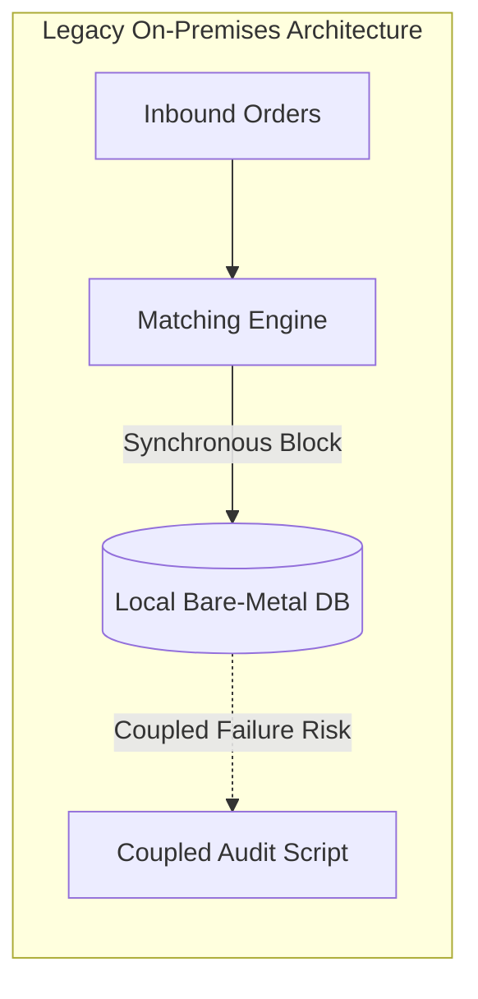
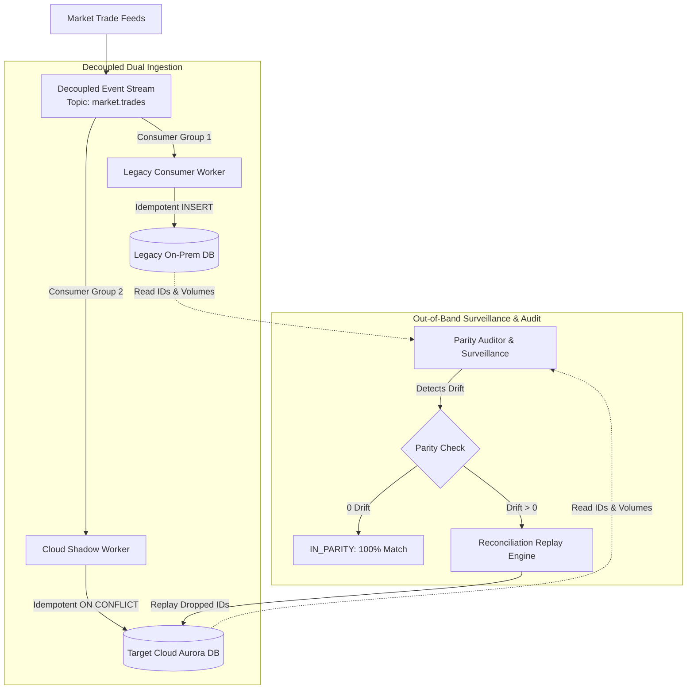
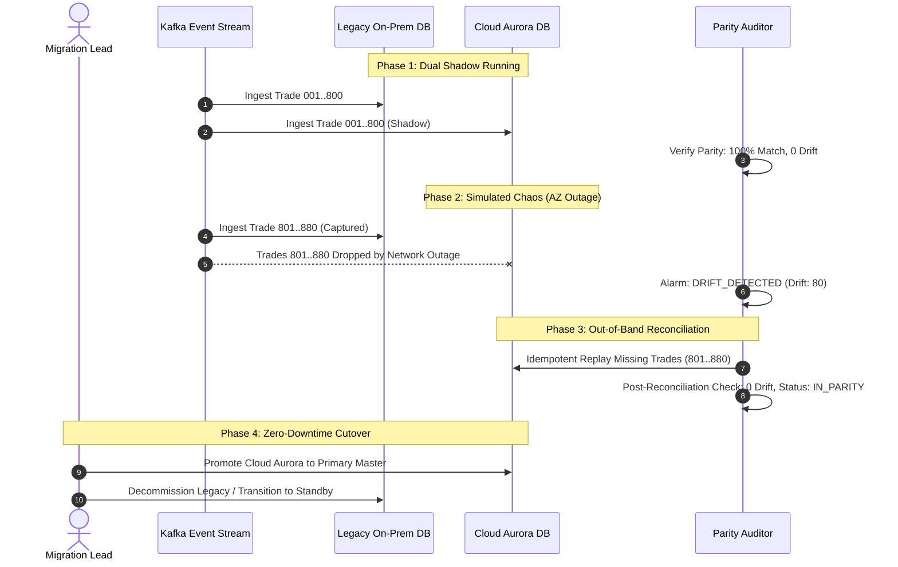

# High-Level Architecture Design (HLD)
## Hybrid Cloud Migration & Out-of-Band Surveillance System

---

## 1. Executive Summary & Core Objective

Modernizing a mission-critical 24/7 financial exchange requires transitioning from a legacy on-premises architecture to an elastic, cloud-native infrastructure (AWS Aurora Multi-AZ) with two non-negotiable requirements:
1. **Zero Downtime (High Availability, 99.999% SLA)**
2. **Zero Data Loss (Absolute Financial Parity & Auditability)**

Rather than a risky "Big Bang" cutover, this system implements a **Decoupled Shadow Running Architecture** coupled with an **Out-of-Band Trade Surveillance & Parity Auditor**.

---

## 2. Solution to Mentor Challenge 1: Existing Legacy Engine Logic

### 2.1 Underneath the Legacy Architecture
The legacy on-premises exchange operates a monolithic matching engine tightly coupled to a single relational database:
- **Order Flow**: Incoming participant orders (`BUY` / `SELL`) enter the order matching pipeline sequentially.
- **Matching Logic**: The core engine matches bids and asks at price-time priority (`FIFO`), synthesizing executed `Trade` events.
- **Bottlenecks & Single Point of Failure (SPOF)**:
  - **Synchronous Write Amplification**: For every trade execution, the matching loop pauses to perform a synchronous disk commit to a local database.
  - **Failover Data Loss Risk**: If the local node degrades during failover, in-flight transactions are truncated, creating unrecoverable financial drift.
  - **Retry Duplication**: Network hiccups cause producer retries that produce duplicate trade records because the legacy database lacks strict idempotency keys across cutover boundaries.

---

## 3. Solution to Mentor Challenge 2: Hybrid Cloud Strategy & Rollback Guarantee

### 3.1 What Stays On-Premise vs What Moves to Cloud
| Component | Hosting Environment | Justification |
| :--- | :--- | :--- |
| **Matching Gateway & Low-Latency Sequencer** | **On-Premise (Bare-Metal)** | Ultra-low latency (< 50 microseconds), co-located directly with exchange liquidity providers. |
| **Decoupled Message Bus** | **Hybrid / Kafka Broker** | Absorbs high-frequency bursts without backpressuring the matching engine. |
| **Shadow Persistence Engine** | **Cloud (AWS Aurora Multi-AZ)** | Elastic storage, cross-AZ durability, instant horizontal read scaling. |
| **Trade Surveillance & Parity Auditor** | **Cloud / Out-of-Band** | Heavy analytical aggregation and compliance auditing completely decoupled from matching latency. |
| **Historical Analytics & Reporting** | **Cloud Native** | Unlocks big data queries without placing read contention on the live matching path. |

### 3.2 Live Topology & Decoupled Shadow Running

---

## 4. Zero Data Loss Rollback & Failback Mechanism

When migrating 24/7 financial systems, network outages, AWS availability zone degradations, or unexpected application faults can occur. The system guarantees **Zero Data Loss on Rollback**:

1. **Decoupled Shadow Isolation**:
   - The Cloud shadow database ingests real production traffic in parallel without being on the critical execution path. If the Cloud environment crashes or partitions, **the Legacy On-Premise system continues processing 100% of live market orders uninterrupted**.
2. **Out-of-Band Parity Detection**:
   - The Parity Auditor computes:
     $$\text{Drift Count} = |\text{Legacy Count} - \text{Cloud Count}|$$
     $$\text{Volume Difference} = |\text{Legacy Volume} - \text{Cloud Volume}|$$
   - Any packet drops or network partitions immediately trigger an out-of-band alert (`DRIFT_DETECTED`), logging the exact missed `trade_id` set.
3. **Idempotent Catch-up Replay**:
   - When the cloud network partition heals, the **Reconciliation Engine** queries the event backlog for the missing IDs and replays them into Cloud Aurora.
   - Because all writes use `ON CONFLICT (trade_id) DO NOTHING` / `INSERT OR IGNORE`, re-running never creates duplicate records.
   - Parity restores to 100% with $0.00 volume discrepancy before final cutover.

---

## 5. Cutover Deployment Strategy: Decoupled Shadow to Blue/Green Promotion

